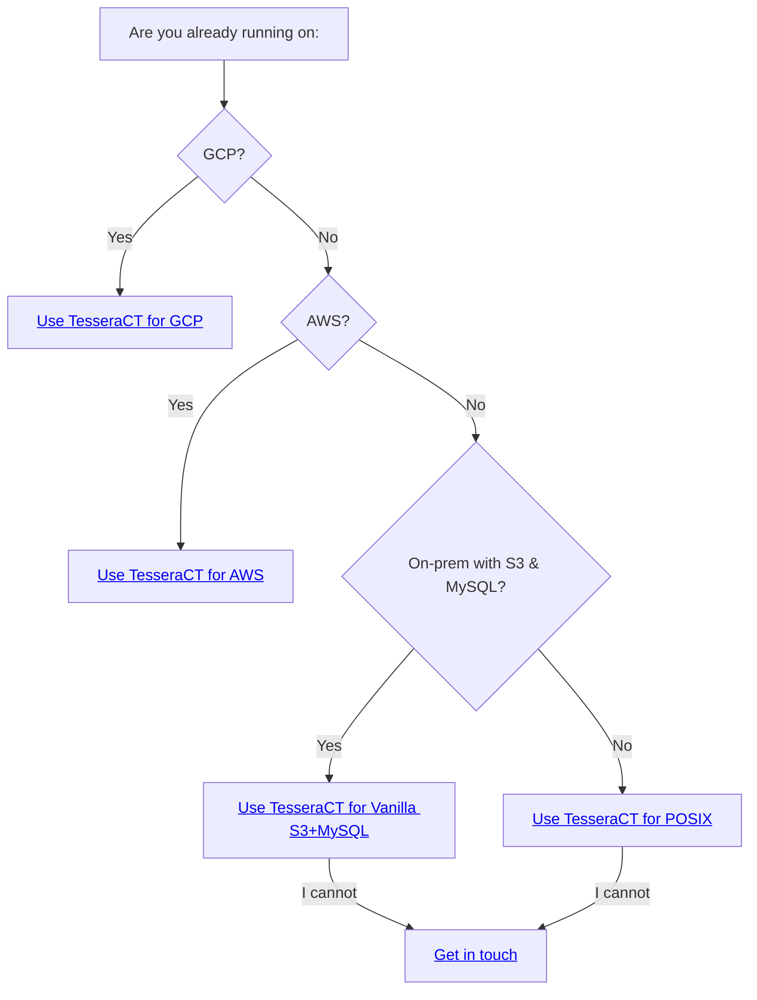

# :deciduous_tree: TesseraCT

[](https://goreportcard.com/report/github.com/transparency-dev/tesseract)
[](https://scorecard.dev/viewer/?uri=github.com/transparency-dev/tesseract)
[](https://transparency-dev.slack.com/)

TesseraCT is a [Certificate Transparency (CT)](https://certificate.transparency.dev/)
log implementation. It implements [static-ct-api](https://c2sp.org/static-ct-api)
using the [Tessera](https://github.com/transparency-dev/tessera)
library to store data, and is aimed at running production-grade CT logs.

At the moment, TesseraCT can run on Google Cloud Platform (GCP), Amazon Web
Services (AWS), POSIX filesystems, or on vanilla
S3+MySQL storage systems with [different levels of maturity](#mega-status).

## Table of contents

[:mega: Status](#mega-status) \
[:motorway: Roadmap](#motorway-roadmap) \
[:joystick: Usage](#joystick-usage) \
[:test_tube: Public test instances](#test_tube-public-test-instances) \
[:card_index_dividers: Repository structure](#card_index_dividers-repository-structure) \
[:raising_hand: FAQ](#raising_hand-faq) \
[:troll: History](#troll-history) \
[:wrench: Contributing](#wrench-contributing) \
[:page_facing_up: License](#page_facing_up-license) \
[:wave: Contact](#wave-contact)

## :mega: Status

TesseraCT is under active development, and will reach alpha in 2025Q3 🚀.

|Platform        |Architecture                                                                                                                                                                          |Our use-case                                                                                           |Performance                            |Binary                                  |Deployment                                                     |
|----------------|--------------------------------------------------------------------------------------------------------------------------------------------------------------------------------------|-------------------------------------------------------------------------------------------------------|---------------------------------------|----------------------------------------|---------------------------------------------------------------|
|GCP             |[Spanner](https://cloud.google.com/spanner/docs) + [GCS](https://cloud.google.com/storage/docs) + [MIG](https://cloud.google.com/compute/docs/instance-groups#managed_instance_groups)|[public staging logs](/deployment/live/gcp/static-ct-staging/logs/)                                    |[gcp](/docs/performance.md#gcp)        |[gcp](/cmd/tesseract/gcp/main.go)       |[doc](/deployment/live/gcp/static-ct-staging/logs/arche2025h1/)|
|GCP             |[Spanner](https://cloud.google.com/spanner/docs) + [GCS](https://cloud.google.com/storage/docs) + [CloudRun](https://cloud.google.com/run?hl=en)                                      |[continuous integration](/deployment/live/gcp/static-ct/logs/ci/)                                      |N/A                                    |[gcp](/cmd/tesseract/gcp/main.go)       |[example](/deployment/live/gcp/static-ct/logs/ci)              |
|GCP             |[Spanner](https://cloud.google.com/spanner/docs) + [GCS](https://cloud.google.com/storage/docs) + [GCE VM](https://cloud.google.com/compute/docs)                                     |[codelab](/deployment/live/gcp/test/)                                                                  |[gcp](/docs/performance.md#gcp)        |[gcp](/cmd/tesseract/gcp/main.go)       |[doc](/deployment/live/gcp/test/)                              |
|AWS             |[RDS](https://aws.amazon.com/rds/) + [S3](https://aws.amazon.com/s3/) + [ECS](https://aws.amazon.com/ecs/)                                                                            |[continuous integration](/deployment/live/aws/conformance/ci/)                                         |N/A                                    |[aws](/cmd/tesseract/aws/main.go)       |[example](/deployment/live/aws/conformance/ci/)                |
|AWS             |[RDS](https://aws.amazon.com/rds/) + [S3](https://aws.amazon.com/s3/) + [EC2 VM](https://aws.amazon.com/fr/ec2/)                                                                      |[codelab](/deployment/live/aws/test/)                                                                  |[aws](/docs/performance.md#aws)        |[aws](/cmd/tesseract/aws/main.go)       |[doc](/deployment/live/aws/test/)                              |
|POSIX           |[ZFS](https://github.com/openzfs/zfs) + VM                                                                                                                                            |[codelab](/cmd/tesseract/posix/), [continuous integration](/.github/workflows/posix_conformance_ci.yml)|[posix](/docs/performance.md#posix)    |[posix](/cmd/experimental/posix/main.go)|[doc](/cmd/posix/)                                             |
|Vanilla S3+MySQL|[MinIO](https://github.com/minio/minio) + [MySQL](https://www.mysql.com/) + VM                                                                                                        |one-off test                                                                                           |[S3+MySQL](/docs/performance#s3--mysql)|[aws](/cmd/tesseract/aws/main.go)       |[doc](/docs/architecture.md#vanilla-s3mysql)                   |

These deployments come with different levels of maturity depending on
our use-case.
Our primary focus so far has been on the GCP with Spanner + GCS + MIG configuration
since we use it for our [public staging logs](#test_tube-public-test-instances).
However, we believe all implementations are correct, and we'd love to
[hear your feedback](#wave-contact) on any of these implementations.

Read the FAQ to understand [why we chose these platforms](#why-these-platforms).

## :motorway: Roadmap

Our objective is to allow log operators to run production static-ct-api CT logs
starting with [temporal shards](https://googlechrome.github.io/CertificateTransparency/log_policy.html#temporal-sharding)
covering 2026 onwards.

At the moment, we are aiming for Beta in 2025Q3, and GA by the end of 2025.

|  #  | Step                                           | Status             | Target release |
| --- | ---------------------------------------------- | ------------------ | ---------------|
|  1  | Storage for GCP, AWS, and POSIX                | :white_check_mark: | alpha          |
|  2  | Lightweight CT compatible x509 fork            | :white_check_mark: | alpha          |
|  3  | static-ct-api APIs                             | :white_check_mark: | alpha          |
|  4  | Basic Antispam                                 | :white_check_mark: | alpha          |
|  5  | Monitoring and metrics                         | :white_check_mark: | alpha          |
|  6  | Secure key management [#219](issues/219)       | :hammer:           | beta           |
|  7  | Witnessing [#443](issues/443)                  | :hammer:           | beta           |
|  8  | Structured logging [#346](issues/346)          | :hammer:           | beta           |
|  9  | CCADB based root update [#212](issues/212)     | :hammer:           | beta           |
|  10 | Client                                         | :hammer:           | 1.0            |
|  11 | Stable APIs                                    | :hammer:           | 1.0            |

Current public library APIs are unlikely to change in any significant way,
however the API is subject to minor breaking changes until we tag 1.0.
Any feedback is welcome.

If you're interested in additional features, [get in touch](#wave-contact).

## :joystick: Usage

### Getting Started

The most hands-on place to start is with one of the
[GCP](./deployment/live/gcp/test),[AWS](./deployment/live/aws/test), or
[POSIX](/cmd/tesseract/posix#codelab) codelabs. These codelabs will guide you
through bringing up your own test TesseraCT deployment.

We also run [public test instances](#test_tube-public-test-instances) that you
can interact with using the [static-ct-api](https://c2sp.org/static-ct-api) API.

You can also have a look at the `main.go` files under [`/cmd/tesseract/`](./cmd/tesseract/)
to understand how to build a TesseraCT server.

Last, you can explore our [documentation](#card_index_dividers-repository-structure).

### Running on a different platform

TesseraCT can theoretically run on any platform
[Tessera](https://github.com/transparency-dev/tessera) supports.

If you'd still like to run TesseraCT on a different platform that Tessera
supports, have a look at Tessera's [Getting Started guide](https://github.com/transparency-dev/tessera/tree/main?tab=readme-ov-file#getting-started),
TesseraCT's `main.go` files under [`/cmd/tesseract/`](./cmd/tesseract/) and their
respective [architecture docs](https://github.com/transparency-dev/tesseract/tree/main/docs/architecture).

We'd love to know what platform you're interested in using,
[come and talk to us](#wave-contact)!

## :test_tube: Public test instances

The following logs are available for testing. These logs run in a staging
environment and should not used for production use cases. They accept chains
rolling up to roots trusted by major root programs.

These logs have been named after La Grande Arche de la Défense
([The Great Arche of the Defense](https://en.wikipedia.org/wiki/Grande_Arche)),
a building in the outskirts of Paris, designed by Johan Otto von Spreckelsen and
Erik Reitzel to celebrate the 200th aniversary of the French Revolution. It is
shaped like a [tesseract](#tesserawhat), and is covered with [tiled](https://c2sp.org/tlog-tiles)
(transparent !) windows.

```json
"description": "Google staging 'Arche2025h1'",
"log_id": "v4vLUgreyaZJbsQJYM1zN+YKJbfu0ef6TGSJJcd2h2s=",
"key": "MFkwEwYHKoZIzj0CAQYIKoZIzj0DAQcDQgAEn7khjUQH1H3NJ/C8QmmBgzoNTptlH6hT5bgiQ6mQcYYg5KZoe4ZK4xCszXu4NH5NiLaDH0wHKsvg3RIQ+TTaag==",
"submission_url": "https://arche2025h1.staging.ct.transparency.dev/",
"monitoring_url": "https://storage.googleapis.com/static-ct-staging-arche2025h1-bucket/",
"mmd": 60,
"temporal_interval": {
  "start_inclusive": "2025-01-01T00:00:00Z",
  "end_exclusive": "2025-07-01T00:00:00Z"
}
```

```json
"description": "Google staging 'Arche2025h2'",
"log_id": "L2UYNygi6ysgrNQ0osu5ivLTWAzifbdx/LfHcYDhOi4=",
"key": "MFkwEwYHKoZIzj0CAQYIKoZIzj0DAQcDQgAEGbSp66Dmq0b3QILTYVpwRgMV9v4tYG2jqBFeWUyg46yW7QL0KbSOUZjN4PYK5dPxfamSkp8Z0JEGL7IA5X9aMg==",
"submission_url": "https://arche2025h2.staging.ct.transparency.dev/",
"monitoring_url": "https://storage.googleapis.com/static-ct-staging-arche2025h2-bucket/",
"mmd": 60,
"temporal_interval": {
  "start_inclusive": "2025-07-01T00:00:00Z",
  "end_exclusive": "2026-01-01T00:00:00Z"
}
```

```json
"description": "Google staging 'Arche2026h1'",
"log_id": "J+sqNJffaHpkC2Q4TkhW/Nyj6H+NzWbzTtbxvkKB7fw=",
"key": "MFkwEwYHKoZIzj0CAQYIKoZIzj0DAQcDQgAEZ+3YKoZTMruov4cmlImbk4MckBNzEdCyMuHlwGgJ8BUrzFLlR5U0619xDDXIXespkpBgCNVQAkhMTTXakM6KMg==",
"submission_url": "https://arche2026h1.staging.ct.transparency.dev/",
"monitoring_url": "https://storage.googleapis.com/static-ct-staging-arche2026h1-bucket/",
"mmd": 60,
"temporal_interval": {
  "start_inclusive": "2026-01-01T00:00:00Z",
  "end_exclusive": "2026-07-01T00:00:00Z"
}
```

## :card_index_dividers: Repository structure

This repository contains:

1. **[Binaries](./cmd/)**: TesseraCT and auxiliary tools
1. **[Deployment configs](./deployment/)**: purely informative, DO NOT
depend on them
1. **Libraries**: enabling the building of [static-ct-api](https://c2sp.org/static-ct-api)
   logs with [Tessera](https://github.com/transparency-dev/tessera):
   [ctlog](./ctlog.go), [storage](./storage/), ([internal](./internal/))
1. Documentation
     <!--Please, keep this in sync with ./docs/README.md -->
     - [Configuration](./docs/configuration.md)
     - [Performance](./docs/performance.md)
     - [Architecture](./docs/architecture.md)
     - [Deployment](./deployment/)
     - Codelabs
       - [GCP](./deployment/live/gcp/test/)
       - [AWS](./deployment/live/aws/test/)
       - [POSIX](/cmd/tesseract/posix/README.md#codelab)
     - [Chain parsing with lax509](./internal/lax509/)

## :raising_hand: FAQ

### TesseraWhat?

TesseraCT is the concatenation of Tessera and CT (Certificate Transparency),
which also happens to be a [4-dimensional hypercube](https://en.wikipedia.org/wiki/Tesseract).

### What's the difference between Tessera and TesseraCT?

[Tessera](https://github.com/transparency-dev/tessera) is a Go library for
building [tile-based transparency logs (tlogs)](https://c2sp.org/tlog-tiles) on
various deployment backends. TesseraCT is a service using the Tessera library
with CT specific settings to implement Certificate Transparency logs complying
with [static-ct-api](https://c2sp.org/static-ct-api). TesseraCT supports a
subset of Tessera's backends. A TesseraCT serving stack is composed of:

- one or multiple instances of a TesseraCT binary using the Tessera library
- Tessera's backend infrastructure
- a minor additional storage system for [chain issuers](https://github.com/C2SP/C2SP/blob/main/static-ct-api.md#issuers)

### Why these platforms?

After chatting with various CT log operators, we decided to focus on GCP, AWS,
and to explore non-cloud-native deloyments. We welcome feedback on these and
requests for additional backend implementations. If you have any,
[come and talk to us](#wave-contact)!

### Which platform should I use?



## :troll: History

TesseraCT is the successor to [Trillian's CTFE](https://github.com/google/certificate-transparency-go/tree/master/trillian/ctfe).
It was built upon its codebase, and introduces these main changes:

- **API**: TesseraCT implements [static-ct-api](https://c2sp.org/static-ct-api)
rather than [RFC6962](https://www.rfc-editor.org/rfc/rfc6962).
- **Backend implementation**: TesseraCT uses [Tessera](https://github.com/transparency-dev/tessera)
rather than [Trillian](https://github.com/google/trillian). This means that
TesseraCT integrates entries faster, is cheaper to maintain, requires running a
single binary rather than 3, and does not need additional services for leader election.
- **Single tenancy**: One TesseraCT instance serves a single CT log, as opposed
to the CTFE which could serve multiple logs per instance. To run multiple logs,
simply bring up multiple independent TesseraCT stacks. For reliability, each log
can still be served by multiple TesseraCT _instances_.
- **Configuration**: TesseraCT is fully configured using flags, and does not
need a proto config anymore.
- **Chain parsing**: TesseraCT uses [internal/lax509](./internal/lax509/) to
validate certificate chains. It is built on top of Go's standard
[crypto/x509](https://pkg.go.dev/crypto/x509) library, with a minimal set of CT
specific enhancements. It **does not** use the full [crypto/x509 fork](https://github.com/google/certificate-transparency-go/tree/master/x509)
that the CTFE was using. This means that TesseraCT can benefit from the good care
and attention given to [crypto/x509](https://pkg.go.dev/crypto/x509). As a
result, a very small number of chains do not validate anymore, head over to
`internal/lax509`'s [README](./internal/lax509/README.md) for additional details.

## :wrench: Contributing

See [CONTRIBUTING.md](./CONTRIBUTING.md) for details.

## :page_facing_up: License

This repo is licensed under the Apache 2.0 license, see [LICENSE](./LICENSE) for
details.

## :wave: Contact

Are you interested in running a TesseraCT instance? Do you have a feature
request? you can find us here:

- [GitHub issues](https://github.com/transparency-dev/tesseract/issues)
- [Slack](https://transparency-dev.slack.com/) ([invitation](https://transparency.dev/slack/))
- [Mailing list](https://groups.google.com/forum/#!forum/trillian-transparency)
