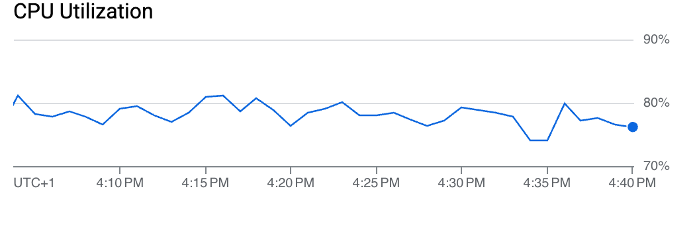
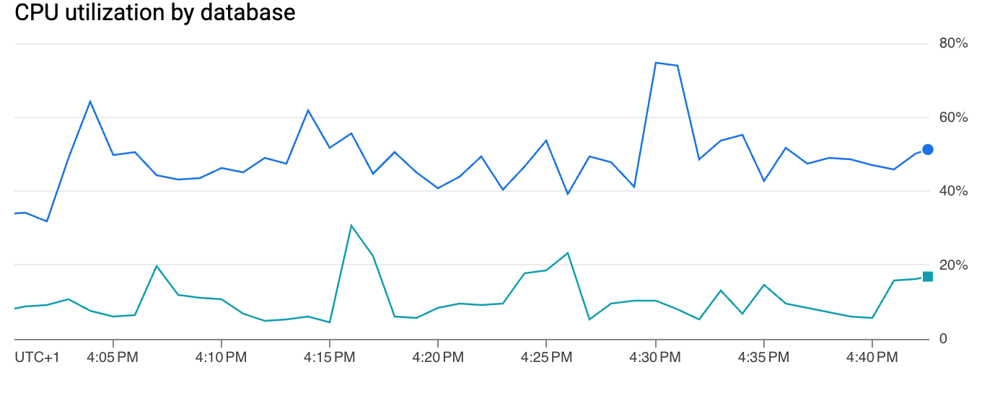
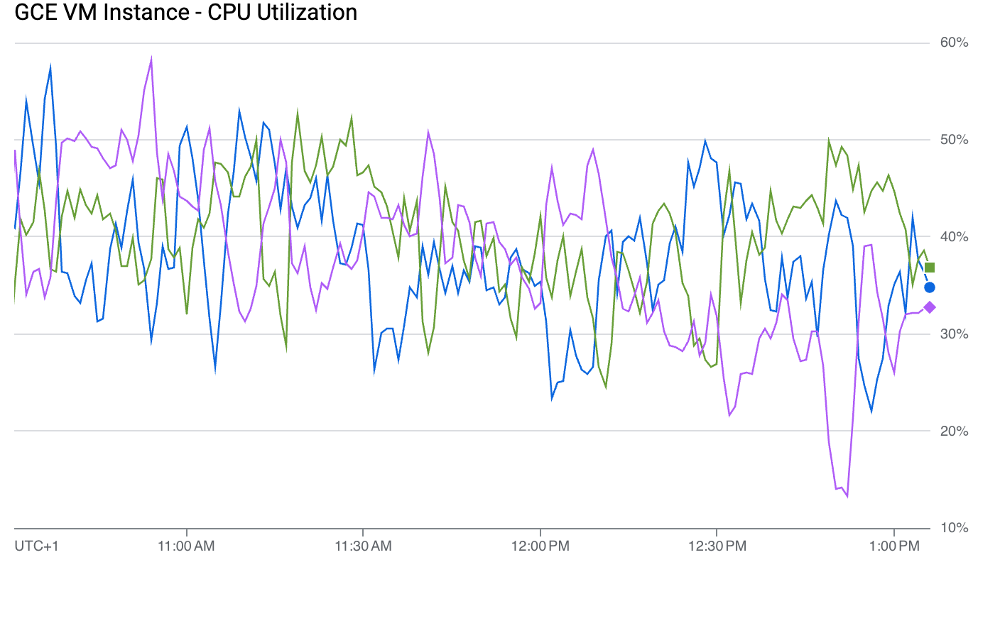
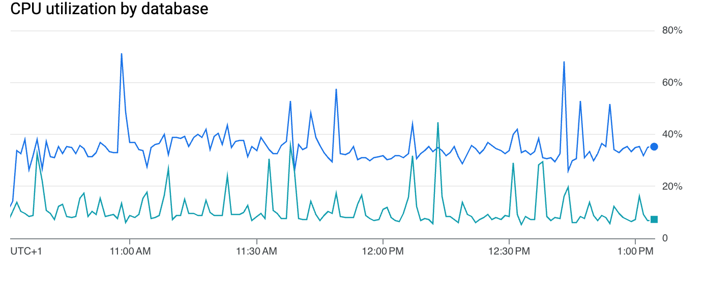

# TesseraCT Storage Performance

TesseraCT is designed to meet current CT issuance load in a cost-effective manner.

The performance tests were conducted in a controlled environment with
deterministic synthetic certificates for a limited amount of time. QPS was
measured using the average values collected over the test period.

> [!NOTE]
> These are not definitive numbers, and performance might evolve as we improve TesseraCT.
> These load tests should be considered as a snapshot of how TesseraCT performed
> at a point in time. Do not hesitate to run such tests with your own infrastructure.

## Index

* [GCP](#gcp)
* [AWS](#aws)
* [POSIX](#posix)
  * [NVMe SSD](#nvme)
  * [SAS HDD](#sas-hdd)
* [S3+MySQL](#s3--mysql)

## Backends

### GCP

The indicative figures below were measured using the [CT hammer tool](/internal/hammer/)
as of [commit `fe7687c`](https://github.com/transparency-dev/tesseract/commit/fe7687c9ed35d11f42a211ee35544ff6c5610ee6).

The table below shows the measured performance over 12 hours in each instance type:

| Instance Type                        | Cloud Spanner | Write QPS |
| ------------------------------------ | ------------- | --------: |
| e2-micro (2 vCPUs, 1 GB Memory)      | 100 PUs       | 60        |
| e2-medium (2 vCPUs, 4 GB Memory)     | 100 PUs       | 250       |
| e2-standard-2 (2 vCPUs, 8 GB Memory) | 100 PUs       | 600       |

| Managed Instance Group Type           | Instances | Cloud Spanner | Write QPS |
| ------------------------------------- | :-------: | ------------- | --------: |
| n2-standard-4 (4 vCPUs, 16 GB Memory) | 1         | 100 PUs       | 1000      |
| n2-standard-4 (4 vCPUs, 16 GB Memory) | 3         | 200 PUs       | 1700      |

#### Standalone VM

##### Free Tier e2-micro VM Instance + Cloud Spanner 100 PUs

* e2-micro (2 vCPUs, 1 GB Memory)

The write QPS is around 60. The bottleneck comes from the VM CPU usage which is
always above 90%. The Cloud Spanner CPU utilization is around 10%.

```bash
┌───────────────────────────────────────────────────────────────────────┐
│Read (0 workers): Current max: 0/s. Oversupply in last second: 0       │
│Write (512 workers): Current max: 68/s. Oversupply in last second: 0   │
│TreeSize: 18372087 (Δ 61qps over 30s)                                  │
│Time-in-queue: 59ms/283ms/1990ms (min/avg/max)                         │
│Observed-time-to-integrate: 79ms/3393ms/8717ms (min/avg/max)           │
└───────────────────────────────────────────────────────────────────────┘
```

```bash
top - 22:38:30 up 12:08,  2 users,  load average: 0.26, 1.20, 1.78
Tasks:  96 total,   1 running,  95 sleeping,   0 stopped,   0 zombie
%Cpu(s): 63.2 us,  9.4 sy,  0.0 ni,  3.8 id, 21.7 wa,  0.0 hi,  0.9 si,  0.9 st 
MiB Mem :    970.0 total,     77.0 free,    901.2 used,    123.0 buff/cache     
MiB Swap:      0.0 total,      0.0 free,      0.0 used.     68.8 avail Mem 

    PID USER      PR  NI    VIRT    RES    SHR S  %CPU  %MEM     TIME+ COMMAND
  61449 user      20   0 2183904 342948  12156 S 183.0  34.5  29:35.23 gcp
```

<details>

<summary>Graphs</summary>


</details>

##### e2-medium VM Instance + Cloud Spanner 100 PUs

* e2-medium (2 vCPUs, 4 GB Memory)

The write QPS is around 250. The bottleneck comes from the VM CPU utilization
which is always around 100%. The Cloud Spanner CPU utilization is around 20%.

```bash
┌──────────────────────────────────────────────────────────────────────┐
│Read (0 workers): Current max: 0/s. Oversupply in last second: 0      │
│Write (512 workers): Current max: 302/s. Oversupply in last second: 0 │
│TreeSize: 11084877 (Δ 224qps over 30s)                                │
│Time-in-queue: 48ms/627ms/1717ms (min/avg/max)                        │
│Observed-time-to-integrate: 1480ms/5401ms/8748ms (min/avg/max)        │
└──────────────────────────────────────────────────────────────────────┘
```

```bash
top - 19:16:15 up 21:43,  2 users,  load average: 1.60, 1.46, 1.50
Tasks:  96 total,   2 running,  94 sleeping,   0 stopped,   0 zombie
%Cpu(s): 86.8 us,  4.0 sy,  0.0 ni,  6.2 id,  0.0 wa,  0.0 hi,  2.2 si,  0.9 st 
MiB Mem :   3924.7 total,   1204.9 free,   2422.4 used,    519.0 buff/cache     
MiB Swap:      0.0 total,      0.0 free,      0.0 used.   1502.3 avail Mem 

    PID USER      PR  NI    VIRT    RES    SHR S  %CPU  %MEM     TIME+ COMMAND
  72343 user      20   0 5082652   1.5g  22856 R 182.7  39.5      6,24 gcp     
```

<details>

<summary>Graphs</summary>


</details>

##### e2-standard-2 VM Instance + Cloud Spanner 100 PUs

* e2-standard-2 (2 vCPUs, 8 GB Memory)

The write QPS is around 600. The bottleneck comes from the VM CPU utilization
which is always around 100%. The Cloud Spanner CPU utilization is around 50%.

```bash
┌──────────────────────────────────────────────────────────────────────┐
│Read (342 workers): Current max: 0/s. Oversupply in last second: 0    │
│Write (683 workers): Current max: 655/s. Oversupply in last second: 0 │
│TreeSize: 14103952 (Δ 583qps over 30s)                                │
│Time-in-queue: 57ms/506ms/1139ms (min/avg/max)                        │
│Observed-time-to-integrate: 642ms/4855ms/9637ms (min/avg/max)         │
└──────────────────────────────────────────────────────────────────────┘
```

```bash
top - 11:12:32 up 58 min,  2 users,  load average: 1.94, 1.94, 1.91
Tasks:  96 total,   1 running,  95 sleeping,   0 stopped,   0 zombie
%Cpu(s): 88.0 us,  3.7 sy,  0.0 ni,  5.6 id,  0.0 wa,  0.0 hi,  2.7 si,  0.0 st 
MiB Mem :   7950.7 total,   4980.7 free,   2029.3 used,   1179.2 buff/cache     
MiB Swap:      0.0 total,      0.0 free,      0.0 used.   5921.5 avail Mem 

    PID USER      PR  NI    VIRT    RES    SHR S  %CPU  %MEM     TIME+ COMMAND
   2114 user      20   0 5211120   1.1g  28572 S 186.7  13.6  78:15.01 gcp
```

<details>

<summary>Graphs</summary>


</details>

###### Publication Awaiter Enabled

The following flags are used:

* `--enable_publication_awaiter`
* `--checkpoint_interval=1500ms`

When the publication awaiter is enabled, the write QPS drops to around 500. The
bottleneck comes from the checkpoint publishing wait time. The VM CPU
utilization is around 75%. The Cloud Spanner CPU utilization is around 35%.

```bash
┌───────────────────────────────────────────────────────────────────────┐
│Read (0 workers): Current max: 0/s. Oversupply in last second: 0       │
│Write (4096 workers): Current max: 526/s. Oversupply in last second: 0 │
│TreeSize: 23350671 (Δ 499qps over 30s)                                 │
│Time-in-queue: 105ms/1245ms/5556ms (min/avg/max)                       │
│Observed-time-to-integrate: 168ms/1769ms/7150ms (min/avg/max)          │
└───────────────────────────────────────────────────────────────────────┘
```

```bash
top - 00:06:07 up  1:06,  2 users,  load average: 1.81, 1.83, 1.65
Tasks:  97 total,   2 running,  95 sleeping,   0 stopped,   0 zombie
%Cpu(s): 70.8 us,  3.8 sy,  0.0 ni, 21.4 id,  0.0 wa,  0.0 hi,  3.8 si,  0.2 st 
MiB Mem :   7950.7 total,   4186.9 free,   2370.5 used,   1657.7 buff/cache     
MiB Swap:      0.0 total,      0.0 free,      0.0 used.   5580.2 avail Mem 

    PID USER      PR  NI    VIRT    RES    SHR S  %CPU  %MEM     TIME+ COMMAND                                                                                                               
   4886 user      20   0 5289880   1.2g  28172 R 154.8  15.2  46:12.52 gcp                                                                                                                   
```

#### Managed Instance Group

The managed instance group setup included a HTTP load balancer on top of the VMs.
The binary was executed in a container.

The following flags were set on the `tesseract` server:

```
--inmemory_antispam_cache_size=256k
--batch_max_size=1024
--batch_max_age=500ms
--enable_publication_awaiter=true
```

##### n2-standard-4 Managed Instance x 1 + Cloud Spanner 100 PUs

* n2-standard-4 (4 vCPUs, 16 GB Memory)

The write QPS was around 1000. The Cloud Spanner utilization was around 55%.
The VM CPU utilization was around 80%.

```sh
┌─────────────────────────────────────────────────────────────────────────┐
│Read (0 workers): Current max: 0/s. Oversupply in last second: 0         │
│Write (10240 workers): Current max: 1018/s. Oversupply in last second: 0 │
│TreeSize: 49456387 (Δ 946qps over 30s)                                   │
│Time-in-queue: 71ms/868ms/3669ms (min/avg/max)                           │
│Observed-time-to-integrate: 153ms/1184ms/5111ms (min/avg/max)            │
└─────────────────────────────────────────────────────────────────────────┘
```

<details>

<summary>Graphs</summary>





</details>

##### n2-standard-4 Managed Instance x 3 + Cloud Spanner 200 PUs

* n2-standard-4 (4 vCPUs, 16 GB Memory)

The write QPS was around 1700. The Cloud Spanner utilization was around 50%.
The VM CPU utilization was around 50%.

```sh
┌────────────────────────────────────────────────────────────────────────┐
│Read (0 workers): Current max: 0/s. Oversupply in last second: 0        │
│Write (10240 workers): Current max: 1740/s. Oversupply in last second: 0│
│TreeSize: 23034935 (Δ 1484qps over 30s)                                 │
│Time-in-queue: 62ms/863ms/5473ms (min/avg/max)                          │
│Observed-time-to-integrate: 80ms/1027ms/7580ms (min/avg/max)            │
└────────────────────────────────────────────────────────────────────────┘
```

<details>

<summary>Graphs</summary>





</details>

### AWS

The indicative figures below were measured using the [CT hammer
tool](/internal/hammer/) as of [commit `fe7687c`](https://github.com/transparency-dev/tesseract/commit/fe7687c9ed35d11f42a211ee35544ff6c5610ee6).

#### t3a.small EC2 Instance + Aurora MySQL db.r5.large

* t3a.small (2 vCPUs, 2 GB Memory)
  * General Purpose SSD (gp3)
    * IOPS: 3,000
    * Throughput: 125 MiB/s

The write QPS is around 450. The bottleneck comes from the VM CPU utilization
which is always around 100%. The Aurora MySQL CPU utilization is around 30%.

```bash
┌────────────────────────────────────────────────────────────────────────┐
│Read (8 workers): Current max: 0/s. Oversupply in last second: 0        │
│Write (512 workers): Current max: 572/s. Oversupply in last second: 0   │
│TreeSize: 2323927 (Δ 470qps over 30s)                                   │
│Time-in-queue: 84ms/887ms/1691ms (min/avg/max)                          │
│Observed-time-to-integrate: 4962ms/6769ms/10524ms (min/avg/max)         │
└────────────────────────────────────────────────────────────────────────┘
```

```bash
top - 22:52:24 up 1 day,  4:23,  2 users,  load average: 1.78, 1.79, 1.21
Tasks: 110 total,   1 running, 109 sleeping,   0 stopped,   0 zombie
%Cpu(s): 75.1 us,  9.0 sy,  0.0 ni,  5.6 id,  0.0 wa,  0.0 hi,  8.5 si,  1.8 st
MiB Mem :   1907.4 total,    427.7 free,    950.6 used,    529.2 buff/cache
MiB Swap:      0.0 total,      0.0 free,      0.0 used.    704.2 avail Mem 

    PID USER      PR  NI    VIRT    RES    SHR S  %CPU  %MEM     TIME+ COMMAND
  92354 ec2-user  20   0 2794864 560568  14980 S 182.7  28.7  48:42.28 aws
```

### POSIX

These tests were performed in a NixOS VM under Proxmox running on a local Threadripper PRO 3975WX machine.

The machine has two independent ZFS mirror pools consisting of:

* 2x 6TB SAS (12Gb) HDD
* 2x 1TB NVMe SSD

The VM was allocated 30 cores and 32 GB of RAM.

The following flags were set on the `tesseract` server:

```
  --checkpoint_interval=1500ms
  --enable_publication_awaiter=true
  --pushback_max_outstanding=40000
  --pushback_max_antispam_lag=40000
```

#### NVMe

The log and hammer were both run in the same VM, with the log using a ZFS subvolume from the NVMe mirror.

TesseraCT sustained around 10,000 write qps, using up to 7 cores for the server.

```bash
┌───────────────────────────────────────────────────────────────────────────┐
│Read (8 workers): Current max: 20/s. Oversupply in last second: 0          │
│Write (30000 workers): Current max: 10000/s. Oversupply in last second: 0  │
│TreeSize: 5042936 (Δ 10567qps over 30s)                                    │
│Time-in-queue: 1889ms/2990ms/3514ms (min/avg/max)                          │
│Observed-time-to-integrate: 2255ms/3103ms/3607ms (min/avg/max)             │
├───────────────────────────────────────────────────────────────────────────┤

```

```bash
top - 14:47:55 up 19:35,  2 users,  load average: 38.65, 31.78, 20.94
Tasks:  39 total,   1 running,  37 sleeping,   0 stopped,   1 zombie
%Cpu(s): 79.5 us,  2.6 sy,  0.0 ni, 17.3 id,  0.0 wa,  0.0 hi,  0.6 si,  0.0 st
MiB Mem :  32768.0 total,  24956.1 free,   7136.5 used,    676.7 buff/cache
MiB Swap:      0.0 total,      0.0 free,      0.0 used.  25631.5 avail Mem

    PID USER      PR  NI    VIRT    RES    SHR S  %CPU  %MEM     TIME+ COMMAND
 280328 al        20   0   18.1g   2.7g  11776 S  1853   8.6  27:11.80 hammer 
 275077 al        20   0   17.7g   3.3g 258716 S 615.6  10.3  52:31.11 posix 
```

#### SAS HDD

The log and hammer were both run in the same VM, with the log using a ZFS subvolume from the SAS mirror.

TesseraCT sustained around 1,600 write qps, using around 1 core for the server.

```bash
┌─────────────────────────────────────────────────────────────────────────────┐
│Read (8 workers): Current max: 20/s. Oversupply in last second: 0            │
│Write (4000 workers): Current max: 2000/s. Oversupply in last second: 1280   │
│TreeSize: 6398419 (Δ 1777qps over 30s)                                       │
│Time-in-queue: 1672ms/2356ms/2819ms (min/avg/max)                            │
│Observed-time-to-integrate: 1909ms/2568ms/3389ms (min/avg/max)               │
├─────────────────────────────────────────────────────────────────────────────┤
```

```bash
top - 14:34:46 up 19:22,  2 users,  load average: 5.16, 6.53, 7.20
Tasks:  39 total,   1 running,  37 sleeping,   0 stopped,   1 zombie
%Cpu(s): 12.3 us,  0.8 sy,  0.0 ni, 85.7 id,  1.2 wa,  0.0 hi,  0.1 si,  0.0 st
MiB Mem :  32768.0 total,  29933.8 free,   2413.3 used,    422.2 buff/cache
MiB Swap:      0.0 total,      0.0 free,      0.0 used.  30354.7 avail Mem

    PID USER      PR  NI    VIRT    RES    SHR S  %CPU  %MEM     TIME+ COMMAND
 272780 al        20   0 4760036 380704  11776 S 283.1   1.1  14:09.56 hammer
 272507 al        20   0   24.3g   1.4g 336236 S  97.0   4.3   4:42.73 posix

```

### S3 + MySQL

S3 + MySQL performance number will highly depend on the S3 and MySQL setup. If
you have the opportunity to run load tests with different relevant setups, we'd
love to hear about them: [get in touch](../README.md#wave-contact)!

#### MinIO MariaDB (from IPng Networks)

This test was performed by [IPng Networks](https://ipng.ch/), around 2025-07-26.
More details are available on their [blog post](https://ipng.ch/s/articles/2025/07/26/certificate-transparency-part-1/).
Kudos to IPng and Pim!

This test was performed with on a Dell R630s running with two Xeon E5-2640 v4
CPUs, with 20 cores, 40 threads, and 512GB of DDR4 memory. The machine had a
SAS controller with 6pcs of 1.92TB enterprise storage (Samsung part
number P1633N19).

The log, hammer, MinIO and MariaDB were running on the same machine.

TesseraCT sustained 500 write qps for a few hours, with:

* TesseraCT using about 2.9 CPUs/s
* MariaDB using 0.3 CPUs/s
* The hammer using 6.0 CPUs/s

Performance started to degrade around 600 write qps.
